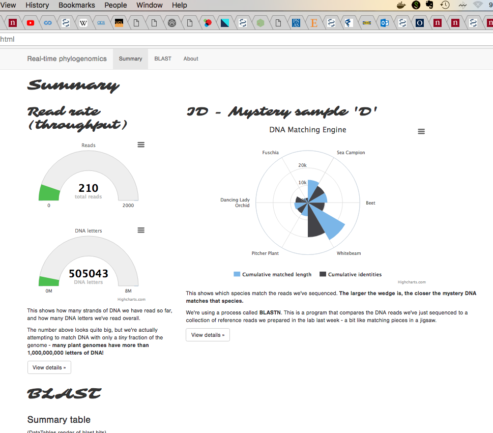

# Raw-rapid-read-reference ID (R4ID) pipeline: Usage

 1) Citation
 2) Introduction
 3) Deployment
 4) Usage
 5) Help

## Citation:
Parker, J., Helmstetter, A. J. H., Papadopulos, A. (2018). Rapid, raw-read reference and identification (R4IDs): A flexible platform for rapid generic species ID using long-read sequencing technology. bioarXiv. https://www.biorxiv.org/content/early/2018/03/13/281048

## Introduction:
The paper and this code document the rapid-raw-read-reference for ID ('R4ID') approach. This comprises the following steps:

- A training step ('r4ids-training'), in which samples of known origin are MinION-sequenced, or public references downloaded, and used to create labelled BLASTN databases for ID;
- A resequencing step ('r4ids-resequencing'), in which samples of unknown origin are MinION-sequenced and compared in real-time to the BLASTN R4ID databases to generate lists of read alignments to the R4ID data;
- A visualisation step ('r4ids-visualisation'), in which the lists of BLAST hits are parsed and displayed as a web GUI over a network connection.

## Deployment
The three images for each step are tagged as r4ids-training-v0.4, r4ids-resequencing-v0.4 and r4ids-visualisation-v0.4 respectively.
They can be pulled from Docker Hub [here](https://hub.docker.com/r/lonelyjoeparker/r4ids/) with `docker pull lonelyjoeparker/r4ids:<tag>`

You will need to set up the following directories on your host filesystem which will be mounted to the three Docker containers as read/write volumes (the names don't actually matter :

 - An `input_training` directory. This is used to build BLASTN databases, should contain **only** .fasta files (one per species). They may be genome assemblies; WGS; or (as in the paper) R4IDS (low-coverage, long-read genomic skim) data. Each species / taxon / sample you want to ID should be a single .fasta file.
 - A `blast_db` directory. The training container will write separate BLAST databases for each of the input species/fasta files, and a `blast_db.conf` file. This is needed by the resequencing container.
 - An `input_resequencing` directory. This should be the basecaller output directory. .fasta files will be BLASTed as they arrive in this directory, and results parsed and written out to the web server.
 - An `output` or `www` directory, which the resequencing container writes to. This directory will also be mounted as the `/www` volume, where .html output is served from, by the visualisation container. This means both visualisation and resequencing containers need concurrent read/write access.

**OSX Users** note that folders OSX are only visible to the Docker daemon (and hence available for mounting as Docker volumes)  by default from folders under `~/Public`.  This behaviour can be changed. See [Docker Docs](https://docs.docker.com/docker-for-mac/osxfs/) for more.

## Usage instructions
Once you've set up the folders, run the three containers as follows:

 1) Train blast DBs:
`docker run -v <directory of .fasta reference genome or R4ID files>:/input_training -v <desired BLAST DB directory>:/blast_db raids-training`

The training data should now be built as BLAST DBs. You can now set up your sequencing run, but first start the other two containers:

 2) Real-time analyse new reads from Albacore:
`docker run -v <dir for new fasta reads from Albacore>:/input_resequencing -v <dir with BLAST DBs from r4ids-training step>:/blast_db -v <real-time BLAST analysis outout dir / r4ids-visualisation www dir>:/output_web raids-requencing`

 3) Real-time visualise results over http. This should be served to http://localhost/KSF.html at port :80.
`docker run -v <real-time BLAST analysis output dir / r4ids-visualisation www dir>:/www -p 80:80 r4ids-visualisation`

Steps 2 & 3 (r4ids-resequencing, r4ids-visualisation) can and should run in parallel and need concurrent access to their shared <real-time BLAST analysis outout dir / r4ids-visualisation www> dir on the physical host (mounted at `/output_web` in resequencing container, and `/www` in visualisation container.

## Help

Please raise an [issue](https://github.com/lonelyjoeparker/oddjects-sandbox/issues) if something looks broken. 

## Contact / maintainer

@lonelyjoeparker
